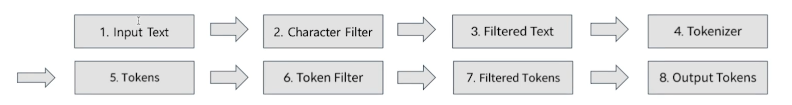
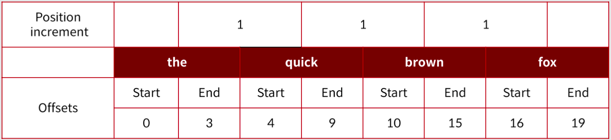

# 2. Elasticsearch에게 Lucene 이란

## 2.1 Lucene

* https://lucene.apache.org
* https://github.com/apache/lucene
* 오픈소스 기반의 검색 라이브러리
* 검색 엔진이 갖춰야 하는 기본 기능인 색인, 검색, 형태소 분석 제공

\

### 2.1.1 Lucene의 구성 요소

1. 역인덱스 파일 구조
2. 색인과 관련된 IndexWriter
3. 검색과 관련된 IndexSearcher
4. 형태소 분석과 관련된 Analyzer

\

### 2.1.2 Lucene 기본 개념

* 인덱스 (Index)
* 문서 (Document)
* 필드 (Field)
* 용어 (Term)

\

* cf) Term < Field < Document < Index와 같은 각 단위의 집합 구조

\

## 2.2 역색인 파일 (Inverted Index Structure)

* 인덱스를 색인어 기반의 검색을 생성하기 위해 색인어에 대한 통계를 저장하는 구조
  * 해당 용어가 얼마나 등장했는 지 (Frequency)
  * 해당 용어가 등장한 문서들에 대한 정보
* 즉, 용어에 대해서 문서를 나열하는 구조가 역인덱스라고 하는 인덱스 계열
  * 입력되는 텍스트들을 문서로 보면 된다.

\

## 2.3 색인 (IndexWriter)

* 색인 시 알아야 하는 정보
  * Index File Formats
  * IndexWriter

\

### 2.3.1 Index File Formats

* Segment File 이라고도 함
* Segment File은 여러 Index File 유형 중 하나
* 색인 파일에는 문서의 Field, Field Data, Term, Frequencies, Position, Deleted Documents 등과 같은 정보가 저장되고 색인과 검색 시 활용된다.
* [Apache Lucene - Index File Formats](https://lucene.apache.org/core/9\_3\_0/core/org/apache/lucene/codecs/lucene92/package-summary.html#package.description)

\

### 2.3.2 IndexWriter

* 색인이란 IndexWriter가 Index File 들을 생성하는 과정이다.
* 생성된 Index File은 수정이 불가능한 Immutable Type 이다.
  * 생성된 파일 안에 있는 내용을 수정, 삭제할 수 없다.
* 여러 개로 생성된 Segments 파일들을 Merge 라는 작업을 통해 하나의 Index File로 만드는 과정이 필요하다.
* 하나의 Index는 하나의 IndexWriter로 구성된다.

\

## 2.4 검색

### 2.4.1 IndexSearch

* 검색이란 IndexWriter로 색인 후, IndexSearch로 검색하는 과정이다.
* IndexSearch 는 IndexReader를 이용해서 검색 수행을 한다.
* 즉, 하나의 Index에는 Segment 별로 N개의 LeafReader가 존재한다.

\

## 2.5 형태소 분석

* 입력 받은 문자열에서 검색 가능한 정보 구조로 분석 및 분해하는 과정

### 2.5.1 구성 요소

* Analyzer
* CharFilter
  * 불필요한 문자열 제거
* Tokenizer
* TokenFilter
* cf) Analyzer는 형태소 분석을 위한 최상위 클래스이며, 하나의 Tokenizer와 다수의 필터로 구성된다.

\

### 2.5.2 Pipelines

<figure><figcaption></figcaption></figure>

* 위 과정에서 6번의 Token Filter 는 정의된 순서에 맞춰 적용되기 때문에 적용 시 **순서가 중요**하다.
  * 동의어 사전 사용 시 대소문자 구분없이 키워드를 관리하는 경우 동의어 사전 필터를 먼저 적용하고 lowercase 필터를 적용하게 되면 대소문자에 대한 불일치가 발생할 수 있다.
    * Lowercase 필터 적용 후 동의어 사전 필터를 적용해야 한다.
* Lucene에서 제공하고 있는 한글 처리를 위한 Analyzer
  * CJK
  * Nori Analyzer

\

### 2.5.3 입력 문자열에 대한 분석 과정

<figure><figcaption></figcaption></figure>

* Position 정보
  * 0부터 시작해서 1씩 증가하는 구조
* Offset
  * 토큰의 start와 end에 대한 정보를 가지고 있음
  * End offset이 실제 토큰의 길이보다 1이 큰 이유
    * token 추출 시 lucene 내부에서 `substring()` 을 사용하기 때문에 길이보다 1 더 크게 설정된다.
* 추출된 token, position, offset 정보를 포함해서 Term 이라고 하고, 이를 이용해서 강조와 동의어에 활용한다.
