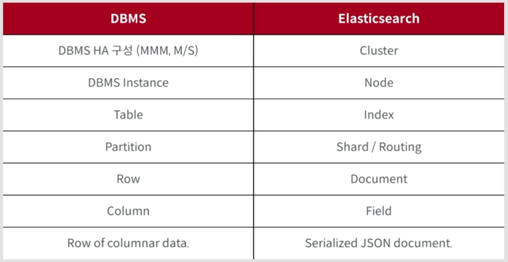
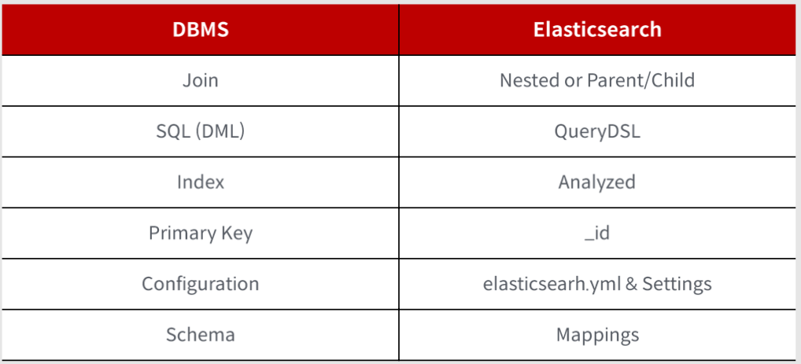

# 3. Elasticsearch

## 3.1 workspace 생성

- 기본 디렉토리 생성

```
-- workspace
  -- docker
  -- standalone
  -- cluster
  -- elasticsearch-7.15.0
  -- filebeat-7.15.0-darwin-x86_64
  -- kibana-7.15.0-darwin-x86_64
  -- logstash-7.15.0
```

- 다운로드 받은 7.15.0 버전의 Elasticsearch, Kibana, Filebeat, Logstash도 workpace 폴더 하위에 위치시킨다.

<br>

## 3.2 DBMS vs Elasticsearch





<br>

## 3.3 Elasticsearch 실행 및 종료

```
cd workspace/elasticsearch-7.15.0
```

<br>

### 3.3.1 ES 실행

```
bin/elasticsearch
```

- `http://localhost:9200/_cat/nodes?v` 에 접속하여 정상적으로 실행됐는 지 확인 가능

<br>

### 3.3.2 ES 실행 (백그라운드)

```
bin/elasticsearch -d -p pid
```

- `-d`: 백그라운드 실행
- `-p pid`: process id를 확인할 수 있는 `pid` 라는 파일이 생성된다.
  - `cat pid` 로 pid 확인 가능

<br>

### 3.3.3 ES 종료

```
pkill -F pid
```

<br>

## 3.4 환경 변수 설정

- Elasticsearch는 JVM 기반으로 실행된다.
- 그렇기 때문에 JDK가 필요하고, JAVA_HOME 환경 변수 설정을 해줘야 한다.
  - JAVA_HOME ->  ES_JAVA_HOME

<br>

## 3.5 Docker로 ES 설치, 실행, 종료

```
cd ./workspace/docker
docker pull docker.elastic.co/elasticsearch/elasticsearch:7.15.0

docker images

docker run -d -p 9200:9200 -p 9300:9300 -e "discovery.type=single-node" docker.elastic.co/elasticsearch/elasticsearch:7.15.0

docker stop/kill <CONTAINER_ID>
```

<br>

## 3.6 ES 구성

- ES 구성 방법에는 2가지가 있다.
  - single node
  - cluster

<br>

## 3.7 ES Single Node 구성

### 3.7.1 Single Node 구성 w/ tar ball

- Standalone 구성에서 가장 중요한 부분
  - `discovery.type=single-node`
  - 자동으로 cluster 구성이 가능하도록 되어 있기 때문
  - 자동으로 cluster node로 합류되지 않도록 위 설정을 해줘야 한다.


```
cd ./workspace/standalone/elasticsearch-7.15.0
```

```
vi config/elasticsearch.yml

cluster.name: es
node.name: single-node
discovery.type: single-node
```

```
bin/elasticsearch -d -p PID
```

- http://localhost:9200/_cat/nodes?format=json&pretty

<br>

- single node ES가 하나 켜져 있는 상태에서 하나 더 실행시켜보기

```
cd ./workspace/standalone
mkdir another
cp ../../_downloads/elasticsearch-7.15.0-darwin-x86_64.tar.gz ./another
cd another
tar -xvzf elasticsearch-7.15.0-darwin-x86_64.tar.gz
cd elasticsearch-7.15.0
bin/elasticsearch
```

- 9200, 9300 포트가 사용 중이기 때문에 9201, 9301 포트로 새로운 ES가 실행되는 것을 확인할 수 있다.
  - 실제 운영 환경에서는 포트 정보를 명확하게 명시하는 것이 좋다.

<br>

```
cd ./workspace/standalone/elasticsearch-7.15.0
pkill -f PID
```

<br>

### cf) elasticsearch.yml 기본 template

```yaml
cluster.name:
node.name:
node.roles:
node.attr.size:
bootstrap.memory_lock: true
path.data:
path.logs:

discovery.seed_hosts:
discovery.type: 
cluster.initial_master_nodes:
cluster.routing.allocation.awareness.attributes: size

network.host:
http.port:
http.compression: true
http.compression_level: 3
http.cors.enabled: false
http.cors.allow-origin: /https?:\/\/127\.0\.0\.1(:[0-9]+)?/
transport.port:
transport.compress: false

gateway.expected_data_nodes:
gateway.recover_after_data_nodes:
action.auto_create_index: true
action.destructive_requires_name: true
xpack.security.enabled: false
xpack.monitoring.enabled: false
xpack.ml.enabled: false
```

<br>

### 3.7.3 Single Node 구성 w/ docker compose

#### 3.7.3.1 docker-compose-single-node.yml 파일 생성

```
cd ./workspace/docker
vi docker-compose-single-node.yml
```

```yaml
version: '3.7'
services:
  fastcampus-es:
    image: docker.elastic.co/elasticsearch/elasticsearch:7.13.2
    container_name: es-singlenode
    environment:
      - node.name=single
      - cluster.name=standalone
      - discovery.type=single-node
    ports:
      - 9200:9200
      - 9300:9300
    networks:
      - es-bridge
networks:
  es-bridge:
    driver: bridge
```

<br>

#### 3.7.3.2 docker-compose 실행

```
docker-compose -f docker-compose-single-node.yml up
docker-compose -f docker-compose-single-node.yml up -d
```

- http://localhost:9200 접속하여 동작 확인

<br>

#### 3.7.3.3 docker-compose 종료

```
docker-compose -f docker-compose-single-node.yml down
```

<br>

## 3.8 ES Cluster 구성

- Elasticsearch의 고가용성을 위한 구성

```
cd ./workspace/cluster
cp ../../_downloads/elasticsearch-7.15.0-darwin-x86_64.tar.gz .
tar -xvzf elasticsearch-7.15.0-darwin-x86_64.tar.gz
```

<br>

### 3.8.1 Cluster 구성 w/ tar ball

#### 3.8.1.1 ES를 3개로 물리적 분리

```
cp -rf elasticsearch-7.15.0 es1
cp -rf elasticsearch-7.15.0 es2
cp -rf elasticsearch-7.15.0 es3
```

<br>

#### 3.8.1.2 클러스터링을 위한 elasticsearch.yml 수정

- 클러스터링 시 가장 중요한 것은 `cluster.name` 을 동일하게 설정하는 것이다.
  - 별도로 설정하지 않으면 `cluster.name` 은 `elasticsearch` 로 동일하게 설정된다.
- `node.name` 은 `es1`, `es2`, `es3` 으로 설정한다.

- 각각의 ES node에 다음과 같이 role을 부여할 수 있다.
  ```
  # deprecated
  node.master: true
  node.data: true
  ```

  ```
  node.roles: ["master", "data"]
  ```

<br>

```
vi es1/config/elasticsearch.yml

cluster.name: es-cluster
node.name: es1
node.roles: [ "master" ]
```

```
vi es2/config/elasticsearch.yml

cluster.name: es-cluster
node.name: es2
node.roles: [ "master", "data" ]
```

```
vi es3/config/elasticsearch.yml

cluster.name: es-cluster
node.name: es3
node.roles: [ "master", "data" ]
```

<br>

#### 3.8.1.3 실행

```
es1/bin/elasticsearch -d -p PID
es2/bin/elasticsearch -d -p PID
es3/bin/elasticsearch -d -p PID
```

- 확인
  - http://localhost:9200/_cat/health?format=json&pretty
  - http://localhost:9200/_cat/nodes?format=json&pretty

<br>

#### 3.8.1.4 종료

```
cd es1 & pkill -f PID
cd es2 & pkill -f PID
cd es3 & pkill -f PID
```


<br>

### 3.8.2 Node 역할의 종류

- `d`: data
- `i`: ingest
- `m`: master
- `r`: remote_cluster_client
  - CCS (Cross Cluster Search)
  - 서로 다른 클러스터들 간의 데이터를 조회하는 데 사용됨

- `-`: coordinating node only
  - 데이터를 가질 수 없음
  - request를 받고 response를 하는 역할만 수행

- `l`: ml (machine learning)

<br>

### 3.8.3 Cluster 구성 w/ docker-compose

#### 3.8.3.1 하나의 yml 파일로 클러스터 구성

```
cd ./workspace/docker
vi docker-compose-cluster.yml
```

- `docker-compose-cluster.yml` 파일 안에는 3개의 노드에 대한 설정이 포함되어 있다.
- 하지만 이와 같이 하나의 yaml 파일을 가지고 단일 인스턴스로 실행시키는 경우는 많지 않고, 각각의 ES 노드 하나 당 하나의 인스턴스로 구성하여 사용한다.
  - 즉, 개별 노드에 대한 설정을 분리해서 작성해야 한다.
  - 이 경우 모든 설정은 동일하지만 설정에 대한 변경은 필요하다.
- 고스펙의 장비에서 여러 인스턴스를 구성할 때는 하나로 구성하는 것이 편할 수 있으며, 개별 인스턴스에 하나씩 실행시켜서 클러스터링할 때는 분리해서 구성하는 게 더 좋다.

<br>

- 클러스터링을 구성하기 위해서는 `discovery.seed_hosts` 와 `cluster.initial_master_nodes` 라는 설정이 반드시 필요하다.
  ```
  environment:
    - discovery.seed_hosts=es1,es2,es3
    - cluster.initial_master_nodes=es1,es2,es3
  ```

<br>

- volume 을 로컬 디렉토리와 연동하기 위해 로컬에 폴더들을 생성해야 한다.
  ```
  volumes:
    - es-data1:/usr/share/elasticsearch/data:rw
    - es-logs1:/usr/share/elasticsearch/logs:rw
  ```

  ```
  mkdir es-data1
  mkdir es-data2
  mkdir es-data3
  
  mkdir es-logs1
  mkdir es-logs2
  mkdir es-logs3
  ```

<br>

- docker-compose 실행
  ```
  docker-compose -f docker-compose-cluster.yml up -d
  ```

<br>

- docker-compose 종료
  ```
  docker-compose -f docker-compose-cluster.yml down
  ```

<br>

#### 3.8.3.2 노드별 yml 파일을 설정하여 클러스터 구성

```
cd ./workspace/docker

vi docker-compose-cluster-node1.yml
vi docker-compose-cluster-node2.yml
vi docker-compose-cluster-node3.yml
```

