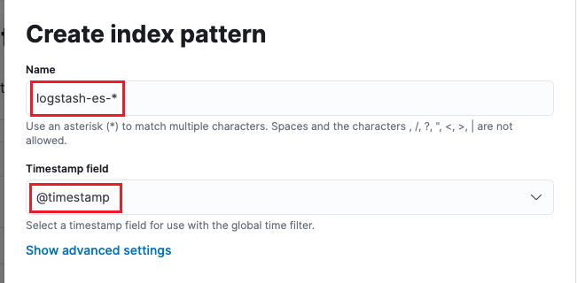
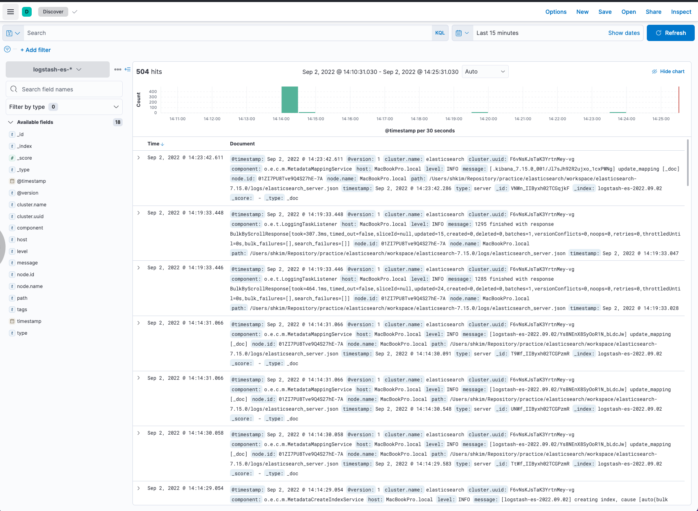
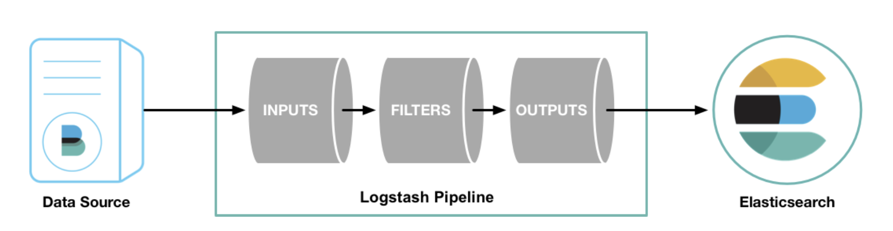
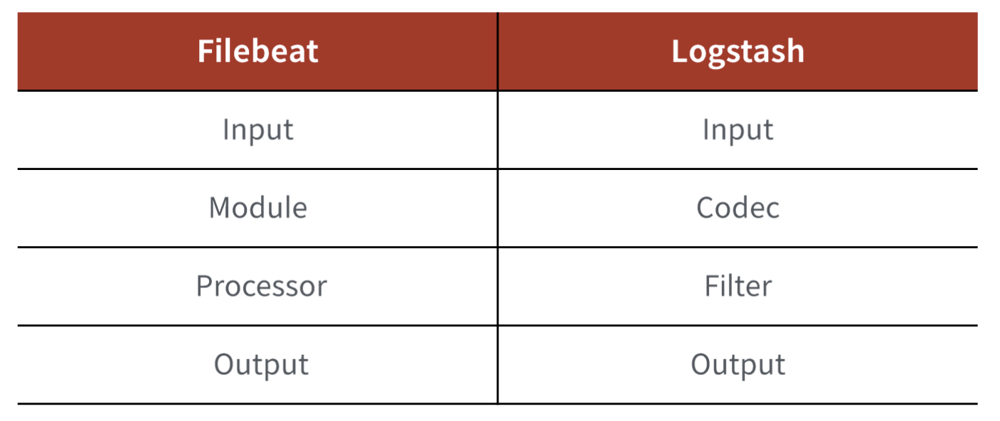
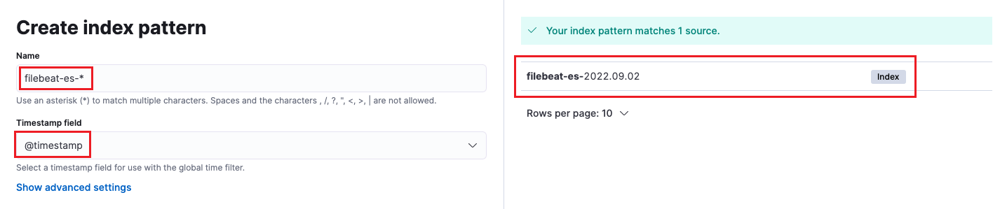
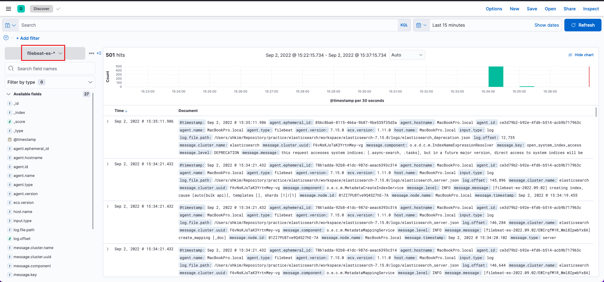

# 5. Logstash & Filebeat

- Logstash와 Filebeat를 통해 실행 중인 ES의 log 데이터 색인

<br>

## 5.0 Prerequisite

### 5.0.1 log level 수정

- ES가 설치된 위치에 config 폴더 아래 `log4j2.properties` 파일을 수정한다.

```
cd ./workspace/elasticsearch-7.15.0
vi config/log4j2.properties

status = error -> status = info
```

<br>

### 5.0.2 ES 실행

```
cd ./workspace/elasticsearch-7.15.0
bin/elasticsearch -d -p PID
```

- log level을 변경한 후 ES를 실행하면 다음과 같은 에러 메세지가 출력될 것이다.
  ```
  main WARN Error while converting string [deprecation] to type [class org.apache.logging.log4j.Level]. Using default value [null]. java.lang.IllegalArgumentException: Unknown level constant [DEPRECATION].
  ```

  

<br>

## 5.1 Logstash

- 다양한 소스 데이터를 가공해서 ES로 적재하는 도구
- 다양한 Input, Filter, Output의 pipeline 구조를 가짐
- 이벤트 데이터에 대한 스트림을 필터할 수 있는 다양한 codec 사용 가능
- Logstash는 자원을 무겁게 사용하기 때문에 Agent로 사용하기보다 데이터를 받아 정제/가공 후 적재하는 Ingestor 역할로 활용하는 게 더 좋다.
- Logstash는 하나의 Node 개념으로 설치 및 구성하는 것을 추천한다.

 <br>

### 5.1.1 Logstash Input, Output 확인

```
cd ./workspace/logstash-7.15.0

bin/logstash -e 'input { stdin { } } output { stdout {} }'
```

- 터미널에 문자를 입력하면 출력 결과를 확인할 수 있다.
  ```
  
  {
        "@version" => "1",
         "message" => "",
      "@timestamp" => 2022-09-02T05:08:03.309Z,
            "host" => "MacBookPro.local"
  }
  hello
  {
        "@version" => "1",
         "message" => "hello",
      "@timestamp" => 2022-09-02T05:08:08.234Z,
            "host" => "MacBookPro.local"
  }
  ```

  

<br>

### 5.1.2 Logstash를 통해 ES 로그 파일 읽기

- Elasticsearch 에서 남긴 log를 logstash에서 input file로 읽고, output으로 ES로 전송

<br>

#### 5.1.2.1 logstash-eslog.conf 파일 생성

```
cd ./workspace/logstash-7.15.0
vi config/logstash-eslog.conf
```

```
input {
  file {
    path => "/Users/shkim/Repository/practice/elasticsearch/workspace/elasticsearch-7.15.0/logs/elasticsearch_server.json"
    start_position => "beginning"
    codec => "json"
  }
}

output {
  elasticsearch {
    hosts => ["http://localhost:9200"]
    index => "logstash-es-%{+YYYY.MM.dd}"
  }
}
```

<br>

#### 5.1.2.2 Logstash 실행

```
bin/logstash -f config/logstash-eslog.conf
```

<br>

#### 5.1.2.3 색인 정보 확인

- `http://localhost:9200/logstash*/_search?pretty=true`

<br>

#### 5.1.2.4 Kibana에서 색인 정보 확인

- Kibana를 통해서도 색인 정보를 확인할 수 있다.
- Discover 메뉴 선택 > Index pattern 등록



<br>

- 다시 Discover 메뉴를 선택하면 색인 정보를 확인할 수 있다.



<br>

### 5.1.3 Logstash 기본 구조 (pipeline)



- 다양한 Data 소스가 존재하고 이것을 input -> filter -> output 을 통해서 데이터를 전달하는 과정이 이루어진다.

<br>

## 5.2 Filebeat

- Beats라는 플랫폼을 사용하는 Stack 들이 많이 있음
  - Beats는 Shipper Agent 역할
- Official Beats와 Community Beats 들이 다양하게 존재
- Logstash 보다 리소스를 적게 사용하기 때문에 Agent로 많이 사용

<br>

### 5.2.1 Filebeat pipeline


- Module
  - 다양한 Input Source 데이터에 대한 수집, 시각화를 위한 형태로 만들어서 제공하기 위한 유틸성 패키지
- Processor
  - 입력 받은 데이터 이벤트의 메시지를 전역으로 처리하기 위해 정의하는 도구

<br>

### 5.2.2 Filebeat vs Logstash



<br>

### 5.2.3 Filebeat 설정 및 진행

```
cd ./workspace/filebeat-7.15.0-darwin-x86_64
```

<br>

#### 5.2.3.1 filebeat-eslog.yml 파일 생성

```
vi ./filebeat-eslog.yml
```

```
filebeat.inputs:
- type: log
  enabled: true
  paths:
    - /Users/shkim/Repository/practice/elasticsearch/workspace/elasticsearch-7.15.0/logs/*.json

json.keys_under_root: true
json.add_error_key: true
json.message_key: log

filebeat.config.modules:
  path: ${path.config}/modules.d/*.yml
  reload.enabled: false

setup.ilm.enabled: false
setup.template.enabled: false

output.elasticsearch:
  hosts: ["localhost:9200"]
  protocol: "http"
  index: "filebeat-es-%{+yyyy.MM.dd}"

#output.logstash:
  #hosts: ["localhost:5044"]

processors:
  - decode_json_fields:
      fields: ["message"]
```

- sudo 권한으로 실행 시키기 위해서는 `filebeat-eslog.yml` 파일의 owner 권한이 root로 되어 있어야 한다.
  ```
  sudo chown root filebeat-eslog.yml
  ```

<br>

#### 5.2.3.2 Filebeat 실행

```
sudo ./filebeat -e -c filebeat-eslog.yml
```

<br>

#### 5.2.3.3 확인

- `http://localhost:9200/filebeat-es-*/_search?pretty=true`

<br>

#### 5.2.3..4 Kibana에서 확인

- index pattern 생성 (Stack Management > index patterns > Create index pattern)



<br>

- Discover에서 색인 데이터 확인

